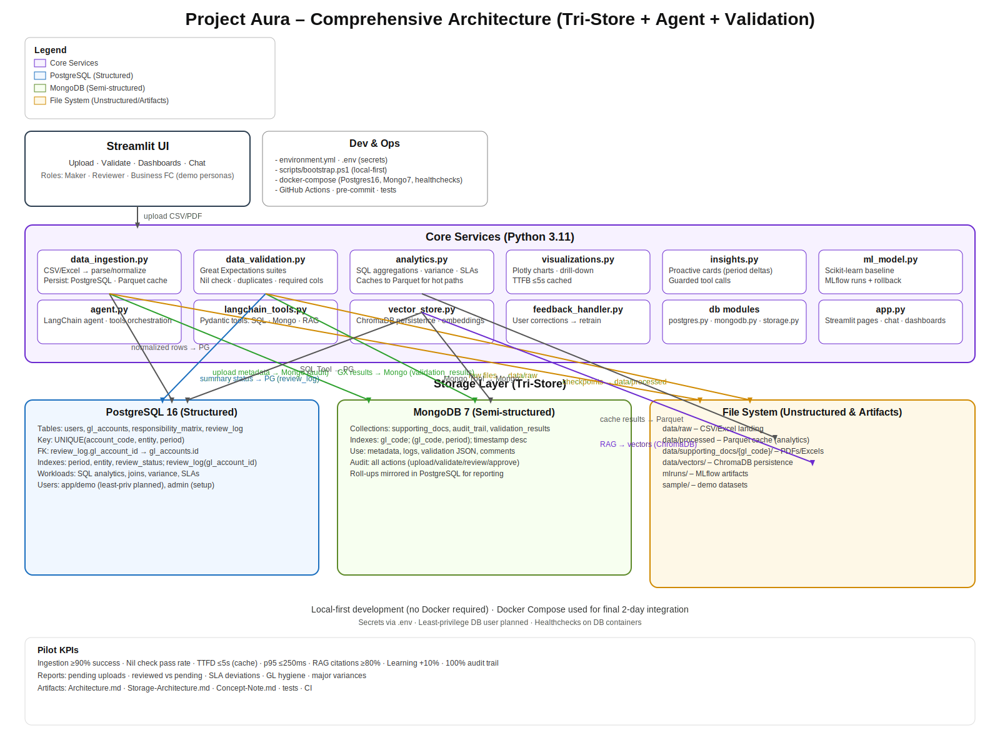

# Project Aura — Architecture

## High-level system diagram

## Components

### Backend Modules

- **data_ingestion.py**: CSV loading, parsing, PostgreSQL insertion
- **data_validation.py**: Great Expectations suites, MongoDB results storage
- **analytics.py**: SQL queries, aggregations, variance analysis
- **visualizations.py**: Plotly charts, drill-down dashboards
- **insights.py**: Automated insight generation, anomaly detection
- **ml_model.py**: MLflow experiments, model training/serving
- **agent.py**: LangChain agent with function calling
- **langchain_tools.py**: Pydantic tools for structured data access
- **feedback_handler.py**: User feedback collection, model retraining

### Storage Layer (Tri-Store Architecture)

**PostgreSQL** - Structured Financial Data
- Users, GL accounts, responsibility matrix
- Review logs with transactional integrity
- SQL analytics for period-over-period comparisons

**MongoDB** - Semi-Structured Metadata
- Supporting document metadata
- Audit trail with nested events
- Validation results with flexible schema
- Comments and annotations

**File System** - Unstructured Data
- `data/raw/` - CSV landing zone
- `data/processed/` - Parquet cache for fast analytics
- `data/supporting_docs/` - PDF/Excel files organized by GL code
- `data/vectors/` - ChromaDB for RAG embeddings

See [Storage-Architecture.md](Storage-Architecture.md) for detailed documentation.

## Quality pillars

- CI/CD with lint/type/test/coverage gates.
- Observability: structured logs, timings, error taxonomy.
- Security: bandit, dependency/license checks.
- Performance: caching, vectorized ops, latency budgets.

## Phase mapping

- **Phase 1 (Day 1)**: Data ingestion + PostgreSQL setup + File storage + UI uploaders
- **Phase 2 (Day 2)**: Validation (GX) + MongoDB + Analytics + Basic visualizations
- **Phase 3 (Day 3)**: Feedback handler + ML model + MongoDB audit trails
- **Phase 4 (Day 4)**: LangChain agent + Tools + RAG (ChromaDB) + Advanced UI
- **Phase 5 (Day 5-6)**: Polish, observability, performance tuning, demo hardening

## Technology Stack

- **Frontend**: Streamlit
- **Backend**: Python 3.11
- **Databases**: PostgreSQL 16, MongoDB 7.0
- **Storage**: File system (Parquet, CSV, PDF)
- **Vector Store**: ChromaDB
- **ML**: Scikit-learn, MLflow
- **Agent**: LangChain, OpenAI
- **Data Quality**: Great Expectations
- **Visualization**: Plotly
- **Infrastructure**: Docker Compose
- **CI/CD**: GitHub Actions, pre-commit hooks
